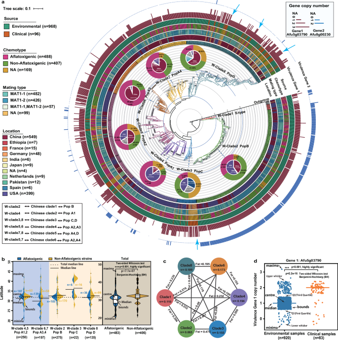
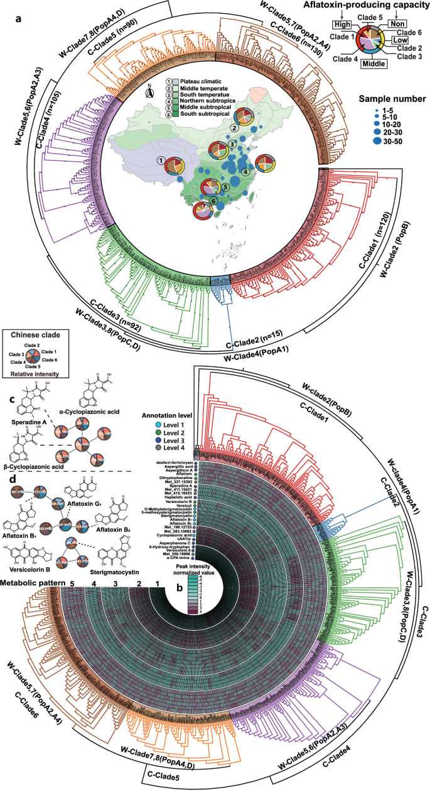
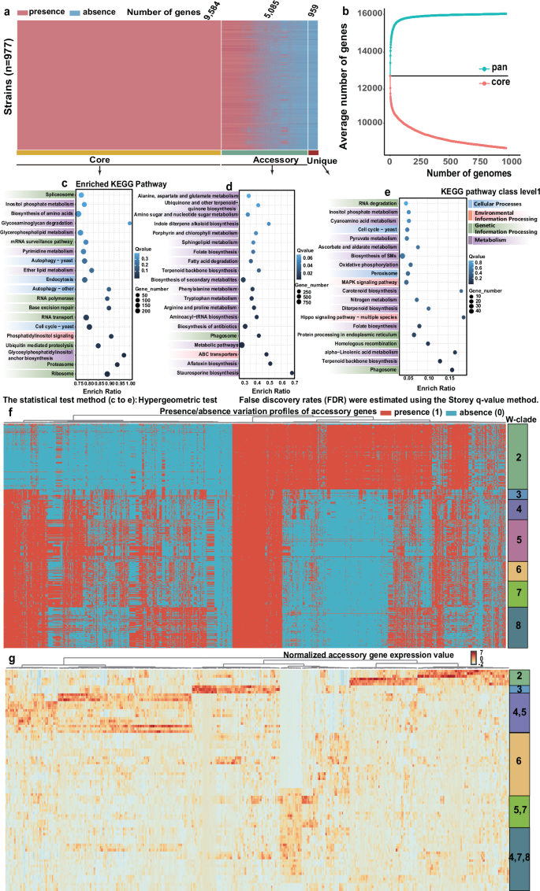
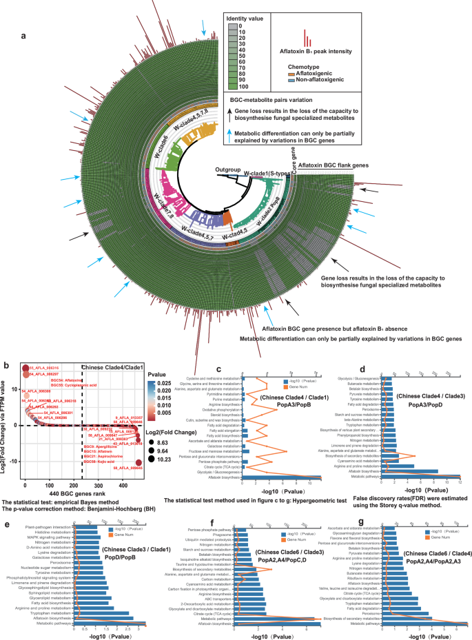
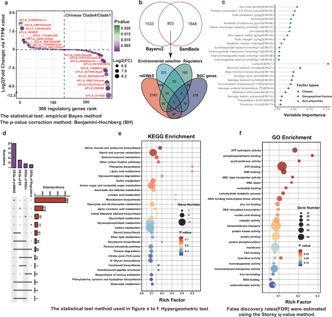
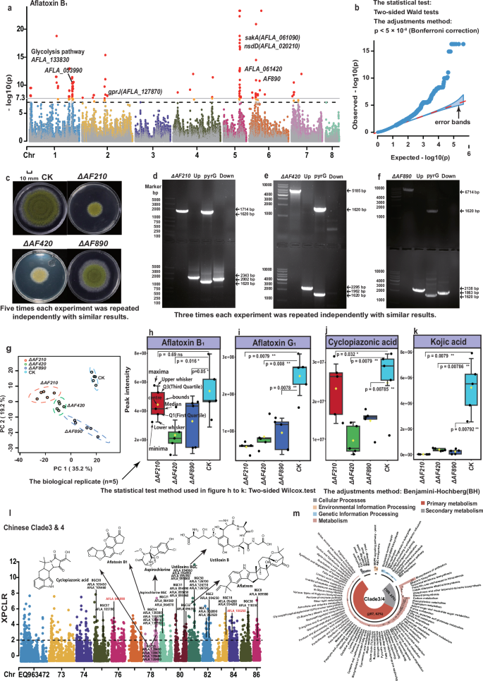
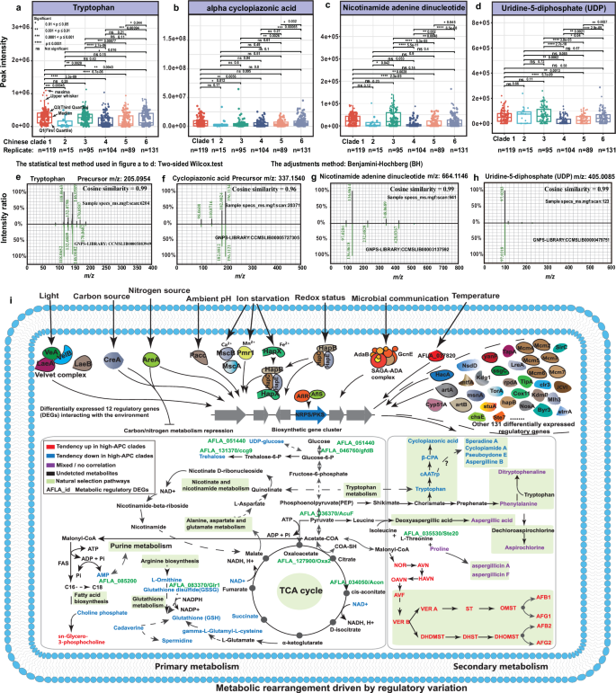

# Nature Communications：1052株黄曲霉跨4大洲多组学图谱——低黄曲霉毒素分支转而产生其他毒素，环境适应重塑代谢网络

黄曲霉（*Aspergillus flavus*）最广为人知的标签，是黄曲霉毒素。尤其是黄曲霉毒素B1，它既是食品安全监测中的核心风险物，也是理解真菌次级代谢最经典的模型之一。

但把黄曲霉简单理解成“会不会产黄曲霉毒素”，会漏掉一个更复杂的问题：**同一个物种在不同地区、不同生态环境中，为什么会形成截然不同的化学表型？**

2026年3月，Nature Communications发表一项大规模多组学研究。研究团队整合了**1052株黄曲霉、覆盖4大洲**的基因组数据，其中包括中国新测序的544株；同时对中国菌株构建代谢组、转录组、环境变量、泛基因组、代谢物GWAS和基因敲除验证体系。

结果显示，黄曲霉的代谢地理格局远比“黄曲霉毒素高或低”复杂。低黄曲霉毒素分支往往会产生其他专属性代谢物，包括环吡唑酸等真菌毒素；而不同群体间的化学差异，只有一部分能够由BGC（生物合成基因簇）的有无或序列变化解释。**调控网络、初级代谢和环境适应相关遗传变异共同决定了不同群体最终输出什么化合物。**

这项工作提供了一个很典型的多组学研究范式：从“哪里有什么菌”，一路追到“为什么不同地方的菌会合成不同化学物”。

---

## 1. 先看研究规模：1052株黄曲霉，横跨4大洲

这项研究首先解决的是样本覆盖问题。

作者从中国多个气候带和地理区域的菌株库中选择544株黄曲霉进行新测序，并加入5株黄曲霉组近缘菌。中国采样区域从广东湛江附近的低纬度地区一直延伸到黑龙江齐齐哈尔，海拔跨度从接近海平面到2300米以上。

这些新测序菌株使用Illumina双端测序，平均测序深度约97×，平均比对率约99%。新组装基因组平均大小约37.9 Mb，GC含量约47.5%。作者还选择27个代表菌株进行PacBio长读长测序，其中8株进一步使用Hi-C辅助到染色体水平。

随后，团队整合508个已公开黄曲霉基因组。这些样本来自美国及其他国家，既包括土壤、玉米、花生等环境来源，也包括临床来源。

最终用于跨大陆系统发育分析的核心数据是**1052株黄曲霉**；加上7个外群，共1059个基因组用于构建高分辨率系统树。

**图1的重点**不是单纯画一棵树，而是把地理来源、临床/环境来源、黄曲霉毒素表型和群体结构叠在一起。作者基于387,282个全基因组SNP，把黄曲霉分成8个主要亚群。

其中，一个以中国南部和中部菌株为主的W-clade 6尤其值得注意：约95%的菌株来自中国南部和中部，约70%的菌株具有黄曲霉毒素产生能力。这个分支过去在以美国样本为主的数据中并不突出，大样本加入后才被更清楚地识别出来。

这说明群体基因组学很容易受到采样地理范围影响。一个“物种结构”如果主要由单一区域样本推断，扩展到全球后往往会出现新的分层。

---

## 2. 黄曲霉毒素存在明显纬度梯度

系统发育结构和黄曲霉毒素表型之间出现了明显关联。

W-clade 4、5、6、7以高黄曲霉毒素产生菌株为主，而W-clade 2和8中非产毒或低产毒菌株比例更高。更有意思的是，产黄曲霉毒素菌株在低纬度地区明显富集。

只看中国样本，84%的产毒菌株来自南亚热带气候区；中亚热带地区也有较高比例的中高水平产毒菌株。

这个地理趋势并不等于“纬度直接控制黄曲霉毒素”。纬度只是一个综合环境代理变量，背后同时伴随温度、湿度、降水、土壤性质、昆虫压力和微生物竞争等多种生态差异。

因此作者后续没有停留在相关性，而是进一步加入了环境变量和遗传适应分析。

---

## 3. 低黄曲霉毒素分支仍可能有复杂化学输出

这篇论文最值得食品安全领域注意的结果之一，来自代谢组。

作者对551份中国来源菌株进行非靶向代谢组检测，共提取出**16,432个代谢特征**。其中36.5%，即5996个，是所有菌株共享的核心代谢特征；其余相当一部分表现出明显的群体或分支特异性。

不同系统发育分支最终可以分成五种较明显的代谢模式。

黄曲霉毒素和环吡唑酸（cyclopiazonic acid，CPA）呈现出近似相反的群体分布趋势：黄曲霉毒素在部分高产毒分支中更高，而一些低黄曲霉毒素分支会增加CPA等其他化合物的产生。

这给生防策略提出了一个现实问题。

农业上常利用非产黄曲霉毒素菌株与产毒菌株竞争，以降低粮食中的黄曲霉毒素污染。论文提示，筛选生防菌株时，仅测“黄曲霉毒素低不低”还不够。一个不产生黄曲霉毒素的菌株，仍可能具有其他真菌毒素或未知专属性代谢物的合成能力。

因此更稳妥的安全评价应逐渐从单一毒素指标扩展到**更完整的代谢谱**。

---

## 4. 泛基因组很大，但基因差异解释不了全部代谢差异

作者从系统树中选择977个代表基因组构建黄曲霉泛基因组。

结果得到**15,628个非冗余蛋白编码基因家族**，比常用参考基因组NRRL3357多3181个。

按出现频率划分：

- 核心基因：9584个，占61.3%；
- accessory基因：5085个，占32.5%；
- 低频/unique基因：959个，占6.2%。

黄曲霉的基因组具有明显可塑性，但这里出现一个很有意思的对比：核心基因约占61%，而代谢组中的核心特征只有约36%–39%。

也就是说，菌株之间的基因组成差异确实存在，但化学表型的变化幅度更大。

这已经暗示：**同一套基因不一定输出同一套代谢物。**

基因是否表达、表达强度、底物和前体是否充足、全局调控网络如何变化，都可能改变最终代谢产物。

---

## 5. 52,511个BGC最后整理成103个可信的独特BGC

真菌专属性代谢研究很自然会关注BGC，即生物合成基因簇。

作者首先用antiSMASH在651个具有匹配代谢组数据的中美黄曲霉基因组中预测BGC，得到**52,511个BGC记录**。BiG-SCAPE初步聚类后形成1707个基因簇家族（GCF）。

但作者没有直接把1707当作真实BGC多样性。

短读长组装中一个BGC可能因为contig断裂被拆成多个片段，从而虚增“新BGC”数量。团队进一步抽取2268条BGC核心蛋白，进行大规模序列比对、不同相似度阈值去冗余和人工校验，最后确认**103个独特BGC**。

外推结果估计整个黄曲霉物种可能包含约120个不同BGC家族。

这一步非常值得方法学上借鉴：**自动BGC预测结果不能直接等同于真实的独立基因簇数量。** 对碎片化真菌基因组，assembly break、边界识别和重复序列都会造成过度计数。

---

## 6. BGC本身只解释了一部分化学差异

如果两个菌株产生不同代谢物，最直观的解释是：它们拥有不同BGC。

论文发现，这个解释成立，但覆盖面有限。

作者分析了已实验验证BGC的存在/缺失情况。以黄曲霉毒素BGC为例，有些菌株确实因为周边基因缺失而降低产毒能力；但仍有相当多菌株在**没有核心基因缺失**的情况下表现为低产毒或不产毒。

在28株代表菌株的转录组中，作者分析58个BGC、共440个表达基因。只有36%的BGC基因表现出显著的分支间差异表达，64%没有达到显著差异。

mGWAS进一步显示，440个BGC基因中约28%（124个）的SNP与代谢差异显著相关，其中44个同时表现出群体间差异表达。

这使研究方向从“有没有这个合成工厂”转向了“这个工厂如何被调度”。

---

## 7. 环境适应把研究推进到基因调控层面

作者为中国采样点整理了21个气候变量、2个地理变量以及24项土壤理化指标，再进行基因型—环境关联分析（GEA）。

这里用了两套独立方法：SamBada和Bayenv2。

SamBada识别出2651个候选局部适应基因；Bayenv2找到3652个环境关联SNP，落在2336个蛋白编码基因区域。两种方法交集得到**803个较稳健的环境适应候选基因**。

这些基因与代谢mGWAS、已知调控基因和BGC基因存在一定交集：803个候选中，191个与2522个mGWAS基因重叠，34个与306个已知调控基因重叠，33个与BGC基因重叠。

随机森林认为较重要的环境变量包括：

**土壤容重、温度、降水、平均相对湿度、土壤pH等。**

研究还定位到多类很有生物学意义的候选基因，例如pH响应调控因子pacC、热休克蛋白、脂肪酸合成相关基因、TCA循环和能量代谢相关基因，以及碳氮源感知和全局转录调控因子。

这些结果支持一种更完整的模型：不同地理环境长期施加选择，改变的不一定只是BGC中的酶编码基因，还会作用于**环境感知—信号传导—转录调控—初级代谢供料**这整套系统。

---

## 8. mGWAS从“相关”推进到16个基因敲除

多组学研究常见的问题是：数据层很多，关联很多，但最终停在候选基因表格。

这篇论文往前多走了一步。

作者先用代谢物GWAS，把基因型与60个代表性代谢物联系起来，得到2522个候选基因。随后从中选择4个已知调控基因和12个功能未知的候选调控基因，共**16个基因**进行敲除实验。

结果有**9个基因敲除会显著影响代谢表型**。

其中nsdD、apsA和一个未表征基因的敲除株不仅菌落生长明显改变，代谢谱也发生重排。16个敲除株中有9个表现出黄曲霉毒素B1、G1、环吡唑酸或曲酸等代谢物的显著下降。

更值得注意的是，某些高产毒分支背景中的基因敲除，会把整体代谢谱推向低产毒分支的状态。

这说明群体特异化学型可以受到上游调控节点强烈影响，一些调控变化就可能让整套代谢网络重新分配。

当然，16个候选只验证了很小一部分关联位点，不能据此把全部群体差异归因于少数调控基因。它更像是证明了这条机制路径确实存在。

---

## 9. 为什么初级代谢会决定“次级代谢”

“次级代谢”这个名称容易让人产生一种错觉：它好像是主代谢之外独立运行的附加模块。

实际情况更接近一套共享资源系统。

黄曲霉毒素、环吡唑酸等化合物需要碳骨架、氨基酸、脂肪酸、乙酰辅酶A、还原力和能量。只要这些前体和辅因子的供应发生变化，即使BGC本身还在，最终产量也会明显不同。

作者用三类证据支持这一点。

第一，选择扫描显示，不同亚群中受到选择的基因里，**58%–66%属于初级代谢相关通路**；相比之下，17%–29%与专属性代谢相关。

第二，mGWAS关联最多的通路集中在糖代谢、氨基酸代谢和脂质代谢。

第三，转录组和代谢组出现配套变化。例如色氨酸在部分低黄曲霉毒素分支中更高，而以色氨酸为前体的环吡唑酸也呈相似趋势。

这张图其实是整篇论文的机制总结：环境适应改变调控网络和初级代谢，随后影响专属性代谢的原料分配、BGC表达以及最终化学谱。

---

## 10. 这项研究给食品安全一个现实提醒：生防菌株需要看“全化学谱”

利用非产毒黄曲霉菌株竞争性排斥产毒菌株，是目前控制黄曲霉毒素的重要生物防治思路。

这篇论文提供了更精细的风险评估框架。

如果候选菌株黄曲霉毒素很低，但同时大量产生CPA或其他尚未充分表征的专属性代谢物，那么仅以“AFB1低”作为安全筛选终点可能不够。

一个更完整的生防菌筛选流程可以加入：

**全基因组BGC扫描 + 标准化培养条件下非靶向代谢组 + 已知真菌毒素定量 + 与目标地区环境相匹配的竞争实验。**

特别是论文显示代谢表型存在明显地理结构后，未来“一个菌株全国通用”的思路也值得重新评估。不同气候和土壤背景可能选择出不同的优势化学型。

---

## 11. 从生信角度看，这篇论文最值得学的是“多组学链条”怎么串起来

如果把整篇研究拆成分析流程，大致可以分成六层。

### 第一层：群体基因组

用全基因组SNP建立系统树、PCA和群体结构，回答不同地区菌株怎么分群。

### 第二层：泛基因组和BGC

构建977株泛基因组，区分核心、accessory和低频基因；用antiSMASH + BiG-SCAPE描绘BGC多样性，并进一步人工去冗余。

### 第三层：代谢组

对551株中国菌株进行UPLC-HRMS/MS非靶向代谢组，使用分子网络和谱库匹配形成pan-metabolome。

### 第四层：转录组

选择28株代表菌株进行转录组，观察BGC、调控基因和初级代谢通路是否随群体发生表达重排。

### 第五层：关联分析

mGWAS把代谢物与遗传变异连接起来；GEA用SamBada和Bayenv2把遗传变异与环境变量连接起来，再寻找mGWAS、环境适应基因、调控基因和BGC的交集。

### 第六层：实验验证

对16个候选基因做敲除，再用代谢组验证化学型是否发生预期改变。

这类设计的价值在于，每一层都承担一个清晰的问题，而不是单纯增加组学数量。

---

## 12. 方法上的几个细节值得注意

### 12.1 同批培养对代谢组尤其重要

作者指出，不同地区已有数据很难直接合并代谢组，因为培养条件和质谱平台差异会强烈影响化学谱。因此中国551株采用统一培养和测定体系，保证群体比较的一致性。

这也是为什么论文的全球基因组样本量达到1052株，但核心pan-metabolome分析主要集中在中国样本。

### 12.2 BGC数量需要去冗余和人工核验

52,511个原始预测BGC最后整理成103个可信独特BGC，说明自动化BGC mining输出很容易被组装碎片化放大。

### 12.3 GEA仍然是关联证据

温度、湿度、降水、纬度和土壤性质高度共线。虽然作者使用两种GEA方法并取交集，随机森林也给出了变量重要性，但仍不能简单理解成“某个环境变量直接导致某个等位基因改变”。

### 12.4 mGWAS也受群体结构影响

不同系统发育群体同时具有不同基因型和不同代谢型，天然存在群体分层。论文使用线性混合模型处理这一问题，但强关联位点仍需要实验验证。16个基因敲除正是为了把部分统计关联推进到功能证据。

---

## 13. 论文的局限在哪里

这项工作样本量很大，但有几个边界需要保留。

第一，全球基因组覆盖和中国代谢组覆盖并不完全对称。代谢组的标准化测定主要集中在中国菌株，因此“全球化学地理格局”仍需要更多跨大陆、同平台培养测定来验证。

第二，环境变量来自采样地理位置及历史气候/土壤数据。真菌分离株当前的代谢表现是在实验室统一条件下测得，这更接近“长期遗传适应留下的化学表型”，不能等同于菌株在原位环境中的即时代谢状态。

第三，很多真菌专属性代谢物仍缺乏高质量MS/MS参考谱。论文自己也指出，数据库覆盖限制了未知代谢物结构注释率。因此低黄曲霉毒素分支产生其他化合物这个方向证据很强，但其中相当一部分化合物还需要进一步结构鉴定和毒理验证。

第四，基因敲除验证了16个候选中的一部分，距离完整解释整个代谢网络仍有很长距离。专属性代谢是多基因、调控、底物和环境共同作用的结果。

---

## 14. 对做微生物组和真菌组学的人，这篇论文有什么方法学启发

这篇工作有一个很清楚的设计原则：**先定义要解释的表型，再逐层加入组学。**

如果研究问题是“为什么不同地区的菌代谢不同”，只做泛基因组很难回答完整。泛基因组能告诉我们哪些基因存在或缺失，却无法解释同一BGC为什么在一个群体高表达、另一个群体沉默。

加入转录组后，可以看到调控状态；加入代谢组后，可以确认真正的化学输出；加入环境数据后，可以寻找长期适应信号；加入mGWAS后，可以找到具体遗传位点；最后通过敲除实验，才有机会把统计关联推进到机制。

这是一条很适合复杂微生物表型研究的通用路线。

---

## 15. 真菌的“化学身份”可以随环境和进化发生重排

黄曲霉的危险性很难被压缩成一个固定标签。

不同地理群体携带相近的大量核心基因，却可以形成明显不同的代谢输出。BGC的获得和丢失提供了一部分解释，而环境适应、转录调控和初级代谢资源分配进一步放大了这些差异。

这项研究描绘的是一种**可塑的化学生态表型**：环境长期选择不同遗传背景，调控网络和初级代谢随之重排，最终让不同群体把有限的代谢资源投入到不同的专属性化合物上。

对食品安全而言，这意味着风险评估需要从单一黄曲霉毒素走向更完整的化学谱；对真菌进化研究而言，这说明代谢多样性不能只从BGC目录中寻找答案；对多组学研究设计而言，它展示了如何把基因组、转录组、代谢组、环境变量和实验验证连成一条可解释的证据链。

---

## 论文信息

**题目：** Large-scale multi-omics profiling reveals environmental and evolutionary drivers of fungal phylogeographic and metabolic diversity  
**期刊：** Nature Communications  
**发表时间：** 2026年3月18日  
**卷期：** Volume 17, Article 4121  
**DOI：** 10.1038/s41467-026-70721-8  
**研究对象：** *Aspergillus flavus*（黄曲霉）  
**主要数据：** 1052株黄曲霉基因组、551株中国菌株代谢组、28株代表菌株转录组、环境变量、mGWAS、GEA及16个候选基因敲除验证。  
**许可：** Creative Commons Attribution-NonCommercial-NoDerivatives 4.0 International（CC BY-NC-ND 4.0）。本文中文内容为独立解读；论文原图如使用，保持Springer Nature提供的完整版本，不裁切、不重绘、不修改。

原文链接：https://www.nature.com/articles/s41467-026-70721-8
