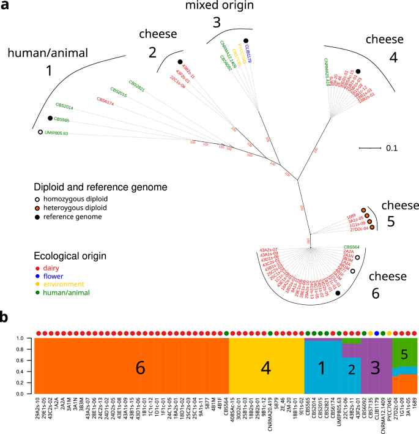
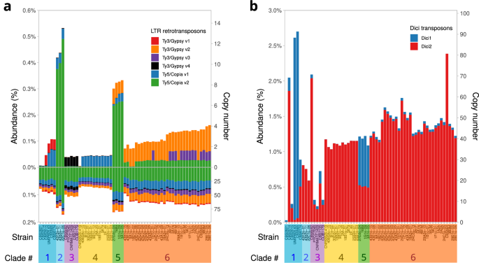
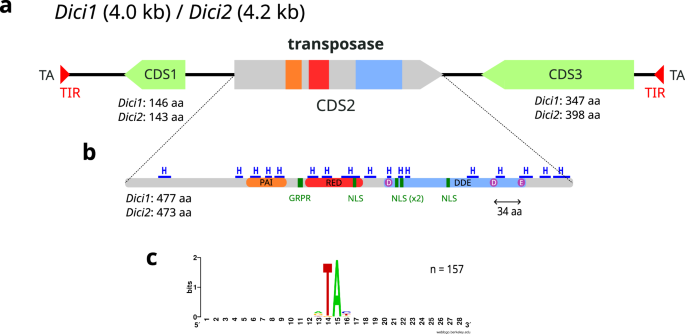
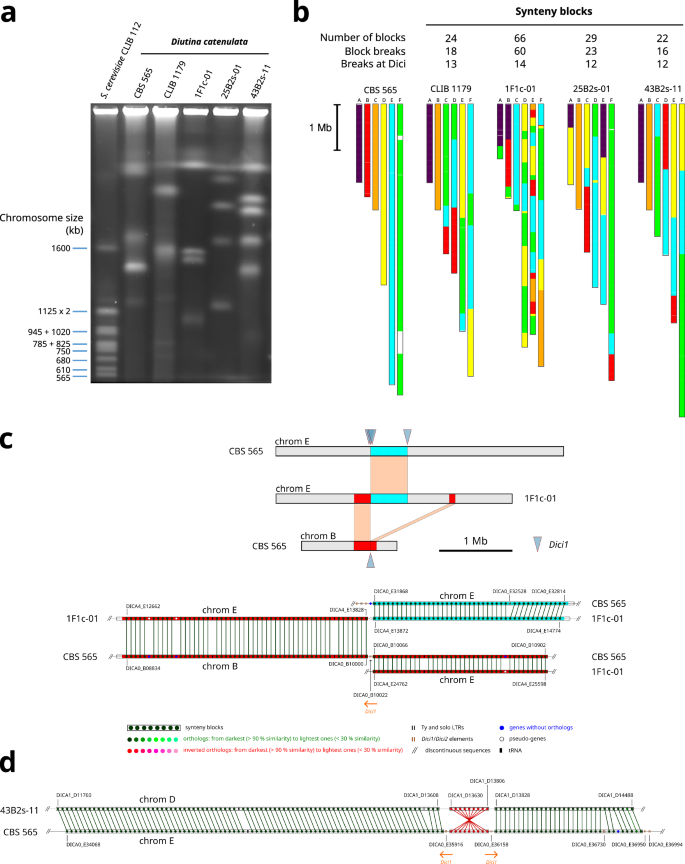
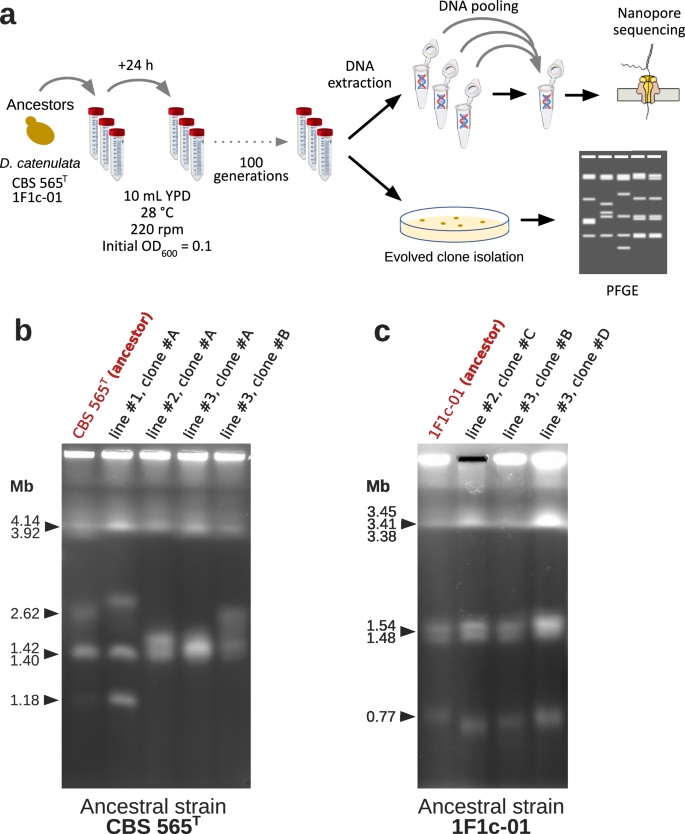
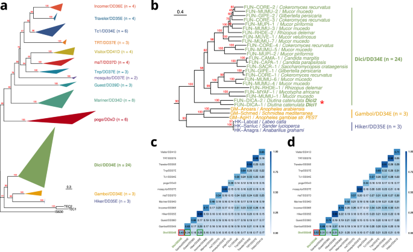

# Nature Communications：61株酵母发现一个仍在“跳”的DNA转座子家族——约100代实验新增27个插入位点，单株最高96拷贝

转座子常被形容成基因组里的“跳跃基因”。这个比喻很形象，但在很多真菌研究中，我们真正看到的往往只是历史留下的痕迹：序列还在，转座能力已经衰退，或者只能从基因组结构推测它曾经活跃过。

2026年，Frédéric Bigey、Marc Wessner、Martine Pradal、Corinne Cruaud、Jean-Marc Aury和Cécile Neuvéglise在 *Nature Communications* 发表研究 **DNA transposon expansion drives genome plasticity in *Diutina catenulata***，把一类此前没有被系统定义的DNA转座子从“基因组注释中的重复序列”一路追到了实验进化中的真实移动事件。

研究对象是 *Diutina catenulata*，旧名 *Candida catenulata*。这种酵母常见于奶酪等食品环境，也能从动物和人体样本中分离出来，已有少量机会性感染病例报道。作者收集了61株菌，做群体基因组、长读长组装、RNA-seq、脉冲场凝胶电泳和实验进化，最终识别出两个高拷贝DNA转座子 **Dici1和Dici2**。

最抓眼球的数字有两个。

第一，模式株CBS 565ᵀ中有 **96个完整Dici1拷贝**。对于酵母DNA转座子来说，这样的拷贝数并不常见。

第二，作者让两个高拷贝菌株在实验室里连续传代约100代后，用Nanopore长读长直接寻找新插入和切除事件。结果在CBS 565ᵀ背景中检测到 **7个新的Dici1插入和2个切除事件**；在1F1c-01背景中检测到 **20个新的Dici2插入和1个切除事件**。

也就是说，Dici并非只是一段保存在基因组里的“化石”。这些元件现在仍然具有转座活性，而且它们很可能参与塑造染色体结构。

---

## 一、为什么一类DNA转座子会成为整篇论文的主角？

转座元件大致可以分成两类。

I类转座元件通过RNA中间体完成“复制—粘贴”，典型代表包括LTR逆转座子、LINE和SINE。II类DNA转座子更多依靠转座酶识别元件两端的末端倒置重复序列，也就是TIR，然后把DNA片段从一个位置切出，再插到另一个位置。

酵母基因组里最经典的转座元件研究长期围绕 *Saccharomyces cerevisiae* 的Ty逆转座子展开。DNA转座子在酵母中的报道相对少，而且很多已经退化。

所以，当作者在 *D. catenulata* 里看到一类重复序列同时具备以下特征时，事情就变得值得追下去：

- 拷贝很多；
- 不同拷贝之间序列高度相似；
- 具有典型TIR和靶位点重复；
- 中间编码完整DDE型转座酶；
- RNA-seq能看到相关基因表达；
- 染色体断点经常出现在这些元件附近。

这些证据共同指向一个很自然的问题：**这些转座子是不是仍然活着，而且正在改变基因组？**

这篇论文最大的价值，就在于作者没有停在生物信息学预测，而是继续做了实验进化和长读长验证。

---

## 二、研究设计：61株群体测序，5个高质量基因组，再加约100代实验进化

作者建立了一个61株 *D. catenulata* 的菌株集合，样本覆盖8个地理来源和5类生态来源。数据中奶酪来源菌株占比较高，同时包含人或动物相关菌株、环境来源菌株和国际菌种保藏中心材料。

所有61株都进行了Illumina短读长测序，平均测序深度约 **140×**。研究者把reads比对到模式株CBS 565ᵀ参考基因组，总共识别 **508,773个变异**，其中包括436,405个SNP和72,368个小型插入缺失。经过质量、缺失率和杂合位点等过滤后，最终用于群体分析的是 **351,942个高质量SNP**。

随后，作者从主要遗传分支中挑选5株代表菌株，包括CBS 565ᵀ、43B2s-11、CLIB 1179、25B2s-01和1F1c-01，使用Nanopore长读长进行高质量组装，并结合Illumina纠错和RNA-seq进行基因注释。

这一步很关键。短读长擅长群体SNP统计，却很难完整解析大量重复序列和染色体重排；长读长可以把转座子、断点和大片段共线性关系连接起来。

作者还使用脉冲场凝胶电泳，也就是PFGE，直接观察不同菌株的染色体大小模式。最后再选两个Dici拷贝特别多的菌株进行实验进化，每个菌株设置3条独立进化线，累计约97–98代。

这套设计实际上把四个尺度连接起来：

**群体SNP → 完整基因组 → 染色体结构 → 实验中的实时转座。**

---

## 三、61株菌先被分成了6个非常清晰的遗传分支

基于351,942个SNP构建最大似然树后，61株菌被分成6个明显clade。作者又从中筛选34,101个近似连锁平衡的SNP，用fastStructure分析群体结构，得到的分群与系统发育结果基本一致。

*图1｜61株* D. catenulata *的系统发育与群体结构。左侧基于351,942个SNP构建系统发育树，右侧展示群体祖源组成。来源：Bigey et al., Nature Communications 2026。*

AMOVA分析进一步显示，**93.6%的遗传变异来自6个clade之间**，clade内部个体之间的贡献很小。群体间FST也支持高度遗传分化。

这个结果说明，这个物种内部已经形成了很强的遗传结构。

有些clade和生态来源存在较明显联系。例如部分分支以奶酪来源菌株为主，另一些包含人体或动物来源菌株。不过它也不是简单的“临床株一支、食品株一支”。同一个PDO奶酪来源的菌株可以落在不同clade；一个来自人血培养物的菌株也可能和奶酪菌株非常接近。

因此，这里的群体结构更像是长期分化、克隆繁殖和有限基因交流共同作用的结果。

作者还注意到5个高质量组装基因组的交配型样位点并不完整。某些菌株只有MTLα1，另一些甚至缺少常见的a1/a2或α1/α2配置。这个观察支持“有性过程可能受限”的假设，不过论文没有把它当成已被实验确认的繁殖机制。

---

## 四、抗真菌药相关基因存在，但基因存在本身不能等同于耐药

由于 *D. catenulata* 偶尔会引起机会性感染，作者也检查了与抗真菌药耐受和宿主互作相关的基因。

ERG11和FKS1等主要药物靶点都存在；CDR1、MDR1等外排泵以及PLB1、SAP5等水解酶存在多个拷贝。

这里要控制解读尺度。

这些基因的存在只能说明菌株具备相应遗传基础。真正的唑类或棘白菌素耐药通常还涉及具体靶点突变、拷贝数变化、表达调控和其他机制。作者同样明确指出，靶基因存在本身不足以证明耐药。

另外，临床模式株和奶酪来源菌株之间没有看到一套截然不同的“致病基因库”。这意味着环境菌株也可能保留一部分与耐药或宿主互作相关的潜力，但是否形成临床表型仍需要药敏和感染实验验证。

---

## 五、真正异常的是Dici：一个菌株里竟然有96个完整DNA转座子

在5个高质量基因组的注释过程中，作者发现了一段反复出现的约4 kb序列。

这类序列两端存在末端倒置重复序列TIR，插入位置两侧会产生TA二核苷酸重复，也就是典型的target site duplication。中间包含3个编码序列，其中第二个CDS编码DDE型转座酶。

作者把它命名为 **Dici**，含义就是 *D. catenulata invader*。

研究中识别出两个主要类型：

**Dici1：约4.0 kb**  
**Dici2：约4.2 kb**

二者核苷酸一致性只有 **52.2%**，说明它们已经发生了明显分化；但两者GC含量都是42.7%，显著低于 *D. catenulata* 核基因组大约53.5%的GC水平。

*图2｜61株* D. catenulata *中不同转座元件的丰度和估计拷贝数。Dici1与Dici2在不同遗传分支和菌株之间呈现很强的拷贝数差异。来源：Bigey et al., Nature Communications 2026。*

最夸张的是模式株CBS 565ᵀ，拥有 **96个完整Dici1拷贝**。

Dici2的分布更广。在61株菌中，有 **54株的Dici2估计拷贝数超过10**。部分菌株的Dici2估计拷贝数达到85、69和63。

更有意思的是，即便两个菌株的SNP距离很近，Dici拷贝数也可能差很多。例如两株临床分离株仅相差255个SNP，但Dici2估计拷贝数分别为6和69。

这提示Dici扩增可以发生得很快，其动态速度可能明显快于核心基因组SNP的积累。

---

## 六、Dici长什么样？核心是一个DD34E型转座酶

Dici结构本身也比较特别。

典型ITm，也就是IS630-Tc1-mariner超家族DNA转座子，通常结构很简单：两端TIR，中间一个转座酶基因。

Dici则含有3个CDS。

CDS1编码一个大约143–146 aa的小蛋白，目前找不到明确同源功能；CDS2编码约473–477 aa蛋白，具有典型DDE催化结构域和DNA结合结构域，是最符合“真正转座酶”的候选；CDS3则是另一个随元件共同存在的编码序列。

*图3｜Dici DNA转座子的结构。元件两端具有TIR和TA靶位点重复，中央CDS2编码带DNA结合域和DD34E催化核心的转座酶。来源：Bigey et al., Nature Communications 2026。*

Dici转座酶中的催化核心符合 **DD34E** 特征：第二个天冬氨酸和谷氨酸之间间隔34个氨基酸。它还包含PAIRED型DNA结合区域、GRPR样motif以及多个预测核定位信号。

这些结构特征把Dici放进了ITm超家族的大框架里，但后面的系统发育分析又显示，它并不落进现有常见家族。

---

## 七、序列高度一致，像是一次很近的“扩增爆发”

判断转座子近期是否活跃，一个很直观的线索就是不同拷贝之间到底有多相似。

如果几十个拷贝已经在基因组中存在了很长时间，通常会逐渐积累大量突变。相反，如果很多拷贝几乎一样，往往意味着扩增发生得比较近。

CBS 565ᵀ里的96个完整Dici1拷贝平均核苷酸一致性达到 **99.9%**。

Dici2也类似。不同菌株内部的Dici2一致性达到99.6–99.8%；跨菌株比较时仍然有99.4–99.6%。作为对照，这些菌株的全基因组一致性大约只有97.7–98.2%。

所以，Dici自身的保守程度明显高于宿主基因组背景。

这与“近期发生快速扩增”的模型很吻合。

不过，单靠序列相似度依然只能支持推测。作者真正把证据往前推进的一步，是直接做实验进化。

---

## 八、染色体结构非常不稳定，而且Dici经常出现在断点附近

5个代表菌株做PFGE后，作者发现它们的染色体大小模式差异很大。即便属于同一个clade、SNP数量相差不多，染色体带型也可能已经明显改变。

随后，研究者使用SynChro和MUMmer4比较5个高质量组装基因组的共线性。

*图4｜5个代表基因组之间存在广泛的染色体重排。Dici经常位于共线性断点附近，图中展示易位和倒位等可能由异位重组产生的结构变化。来源：Bigey et al., Nature Communications 2026。*

CBS 565ᵀ与1F1c-01之间的比较产生了最多的共线性片段，共 **66个synteny blocks**。在这一比较中，超过20%的断点与Dici位置相关。

换用Dici拷贝较少的CLIB 1179作参考时，某些比较中Dici仍出现在很高比例的断点附近。例如对CBS 565ᵀ的比较中，18个断点有13个，也就是 **72%** 与Dici相关；对1F1c-01的比较中则为10/50，也就是20%。

作者提出了两类可能机制。

一种是不同染色体上的Dici拷贝发生异位同源重组，直接造成易位、倒位等结构变化。另一种是多个转座子同时切出产生DNA双链断裂，后续通过NHEJ等误差更高的DNA修复途径重新连接，从而形成新的染色体结构。

论文还明确给出了一个限制：**部分断点附近没有检测到Dici**。例如CLIB 1179与43B2s-11之间有7个断点没有伴随Dici。

因此，Dici是这套基因组可塑性的一个重要推动因素，但当前证据无法把所有染色体重排都归因于Dici。

---

## 九、最关键的实验：养约100代，直接看它会不会跳

为了测试Dici1和Dici2是否仍有转座能力，作者选了两个高拷贝菌株：

CBS 565ᵀ主要富集Dici1，1F1c-01主要富集Dici2。

每个背景设置3条独立进化线，在YPD培养基中每天传代。CBS 565ᵀ累计 **97±1代**，1F1c-01累计 **98±0.7代**。

由于新转座事件预期比较稀少，作者把同一菌株的3条进化线DNA合并后进行ONT R10.4.1长读长测序，并在比对前把参考基因组中已有Dici区域进行soft-mask，以降低reads优先贴回旧拷贝造成的偏差。

*图5｜Dici实验进化验证。两个高拷贝菌株分别建立3条独立进化线，约100代后使用长读长检测新插入、切除和染色体结构变化。来源：Bigey et al., Nature Communications 2026。*

结果很直接。

CBS 565ᵀ进化群体中检测到 **7个新的Dici1插入位点和2个切除事件**。

1F1c-01进化群体中检测到 **20个新的Dici2插入位点和1个切除事件**。

这27个新插入是整篇论文最硬的一组证据：Dici1和Dici2都能在实验条件下继续移动。

同时，PFGE给出了另一个非常有意思的结果。

CBS 565ᵀ进化体系中分离的4个克隆，**4个都出现了与祖先不同的染色体带型，而且彼此也不同**。1F1c-01体系中分析的3个克隆则没有看到明显核型变化。

这说明“转座活性”和“大尺度染色体重排”之间的关系可能具有强烈的菌株背景依赖性。Dici很多，并不保证每个背景在100代内都出现可见的大型核型改变。

研究者还在长读长中找到与Dici位置一致的染色体易位证据。例如CBS 565ᵀ进化群体中检测到B、E染色体之间的重组；1F1c-01中则有14条reads支持D、F染色体之间的互易易位。

---

## 十、一个方法学细节：这项实验不能告诉我们“每代跳几次”

这里有一个容易被数字误导的地方。

作者把每个菌株的3条独立进化线DNA混合后再做测序，目的是提高低频转座事件的检出率。这样做非常适合回答“有没有新的Dici插入”，却失去了每个事件来自哪条进化线、在群体中达到什么频率的信息。

因此，论文检测到7个和20个插入事件后，**无法据此计算Dici的转座频率**。

我们也不能把“27个新插入/约100代”直接换算成每代0.27次转座。样本由多个独立群体混合，检测灵敏度还受到长读长覆盖度和低频事件比例影响。

这类实验设计上的边界值得保留，因为它决定了数字应该怎么解释。

---

## 十一、Dici不只属于一个物种：作者把它扩展成了一个新的真菌DNA转座子家族

确认Dici转座酶后，作者进一步拿Dici1和Dici2的转座酶序列去搜索公开的原核和真核基因组数据库。

最终在其他真菌中找到了 **22个候选同源转座酶**。其中3个来自子囊菌门，19个来自毛霉菌门。

加上Dici1和Dici2，一共得到24条Dici家族候选转座酶。

*图6｜24条Dici家族转座酶与ITm超家族代表序列的系统发育和序列一致性比较。Dici形成独立、高支持度的分支。来源：Bigey et al., Nature Communications 2026。*

系统发育分析中，Dici形成了一个 **bootstrap支持率100%** 的独立分支，与Gambol/DD34E和Hiker/DD35E较接近，但仍能清楚区分。

Dici家族不同转座酶全长平均两两一致性约40%，只看催化域时提高到约52%。与Gambol和Hiker相比，全长一致性大约24–25%，催化区约31%。

作者因此把Dici定义为ITm超家族中一个此前没有被描述过的DNA转座子家族。

这里的“新家族”来自转座酶系统发育、催化motif、TIR/TSD结构和序列比较等多层证据，并非只根据一个BLAST相似性阈值命名。

---

## 十二、Dici到底什么时候进入这个物种？论文保留了两种模型

Dici在 *D. catenulata* 各个遗传分支中都能检测到，同时Dici拷贝之间又保持极高序列一致性。

这两个现象放在一起，会产生一个时间上的难题。

如果Dici早在所有clade分化之前就已经存在，那么它可能在共同祖先中被获得，之后发生一次扩增爆发，染色体重排进一步降低不同群体之间的基因交流。

另一种可能是，各clade已经明显分化之后，Dici才较近期进入这些基因组；随后通过多次独立引入或lineage之间的水平转移扩散，再在各菌株中快速扩增。

当前数据还无法在这两个历史模型之间做最终选择。

这一点很重要，因为“高序列一致性”支持近期扩增，却无法单独告诉我们最初的获得时间和传播路径。

---

## 十三、转座子、染色体重排和群体分化之间，因果链还缺哪些环节？

从结果上看，三个现象同时存在：

1. *D. catenulata* 有6个高度分化的群体；
2. Dici在很多菌株中高拷贝并保持活性；
3. 染色体之间存在大量易位、倒位和共线性断裂。

它们之间存在很强的机制联系线索。大量Dici提供重复序列，异位重组可以产生结构变异；结构差异进一步可能降低杂交个体的减数分裂兼容性，从而限制基因交流。

但这条链目前仍包含推断。

首先，作者没有直接做不同clade之间的杂交实验，因此尚未证明染色体重排确实导致杂交不育。

其次，一部分结构断点不伴随Dici，其他重复序列、DNA损伤和修复过程同样可能参与。

第三，Dici扩增是lineage分化的驱动因素、后续加速因素，还是二者兼有，目前仍难区分。

所以，最稳妥的表述是：**Dici为*D. catenulata*的染色体可塑性提供了一个活跃且有实验证据支持的机制来源，并可能参与强化不同遗传分支之间的结构分化。**

---

## 十四、为什么这篇论文对做真菌基因组的人很有参考价值？

这项工作的方法组合非常值得借鉴。

### 1. 看到强群体结构时，不要只盯着SNP

如果一个物种的不同菌株在SNP层面已经形成明显clade，可以进一步检查染色体结构、重复序列和转座元件。群体分化有时会同时发生在序列和基因组架构两个层面。

### 2. 研究转座子时，短读长和长读长各有任务

作者用61株短读长估算Dici丰度和拷贝数，非常适合群体尺度比较；真正解析完整元件、插入边界和染色体重排，则依赖5个长读长组装。

一个实用框架是：

**短读长负责“广”，长读长负责“深”。**

### 3. 拷贝数高不等于活跃

仅凭几十个转座子拷贝，仍然无法证明它今天还在移动。序列高度一致、转座酶结构完整、RNA表达可以不断增强这个判断，最后的实验进化才把“活性”真正落到新插入事件上。

### 4. 染色体带型仍然有价值

在全基因组测序时代，PFGE看起来像一项很传统的技术。但这篇研究里，它快速显示了同一clade内部都可能存在明显核型差异，也帮助作者筛选和验证实验进化后的染色体变化。

### 5. 转座子研究最好把结构证据和进化证据结合起来

Dici最后能够被定义成一个新家族，靠的是TIR/TSD、DD34E催化结构、系统发育、蛋白序列一致性和跨物种搜索的组合。

单一方法很难把“这是什么”和“它在做什么”同时回答完整。

---

## 十五、几个需要特别注意的研究局限

第一，61株菌的采样并不均衡，多数样本来自法国奶酪相关环境，临床分离株数量有限。因此，当前6个clade的频率和生态分布不能直接外推到全球 *D. catenulata* 群体。

第二，Dici拷贝数在61株中的估计主要依赖短读长mapping和标准化read depth。对于高度重复序列，这种方法非常适合群体比较，但具体单个插入位点仍需要高质量组装或长读长确认。

第三，实验进化只用了两个高拷贝菌株、约100代，并且把三条独立进化线混合测序。因此，它证明了转座活性，却没有给出精确转座率，也无法覆盖不同环境压力下的长期动力学。

第四，Dici与染色体断点之间的共定位很有说服力，但不能覆盖所有结构变异。论文自己也观察到没有Dici信号的断点。

第五，关于Dici起源，祖先早期获得和近期水平传播两套模型都还存在。需要更广泛的全球菌株、近缘物种和完整基因组才能进一步缩小答案范围。

---

## 十六、这项研究和“机会致病真菌”有什么关系？

*D. catenulata* 同时出现在食品、环境、动物和人体样本中，这使它很适合研究“环境酵母如何具备临床机会致病潜力”。

不过，这篇研究没有证明Dici会直接提高毒力，也没有证明高Dici拷贝的菌株更耐药。

Dici最直接的作用证据集中在基因组结构：它能够转座，与部分染色体断点共定位，并伴随快速核型变化。

从更长的时间尺度看，频繁结构变异可能改变基因剂量、调控环境、连锁关系和群体间基因交流。这样的基因组可塑性可以给适应提供原料，也可能带来基因组不稳定的成本。

所以，对临床和食品安全的真正意义在于：**一个看起来生态分布广泛、临床病例并不多的酵母，内部可能拥有非常活跃的基因组重塑机制。** 未来如果研究耐药、宿主适应或环境迁移，Dici会是值得重点监测的一类结构变异来源。

---

## 十七、数据和分析资源

论文产生的测序数据和注释基因组已经提交到ENA，umbrella project accession为 **PRJEB94530**。

作者还把支持数据和代码上传到Zenodo：**10.5281/zenodo.17613032**。

从复现角度看，这篇文章的方法链条也比较完整：

Illumina短读长用于61株群体变异分析；GATK完成variant calling；IQ-TREE和fastStructure解析系统发育与群体结构；ONT长读长用于5株高质量组装以及实验进化后的转座事件检测；SynChro和MUMmer4分析共线性；InterPro、MAFFT、IQ-TREE和HyPhy用于Dici结构、系统发育和选择压力分析。

如果要把这套工作迁移到其他非模式真菌，一个很现实的起点就是：**群体短读长 + 少数代表菌株长读长 + TE注释 + 染色体结构比较 + 小规模实验进化。**

---

## 十八、结语

把这篇研究概括成“发现了一个新转座子”会漏掉最重要的一半。

作者真正完成的是一条比较完整的证据链：先从61株群体数据里看到强烈遗传结构，再在高质量基因组中发现异常扩增的Dici1/Dici2，随后把这些元件和染色体重排联系起来，最后通过约100代实验进化直接观察到新的插入、切除和结构变化。

Dici1在单个菌株里可以达到96个完整拷贝；Dici2在绝大多数菌株中超过10个估计拷贝；27个新的实验性插入事件证明它们仍然具有转座能力。跨真菌搜索又把Dici扩展成一个新的ITm DNA转座子家族。

这让 *D. catenulata* 成为一个很有意思的真菌基因组模型：核心基因组已经分成深度分化的lineage，移动DNA仍在持续活动，染色体架构也处于高度可塑状态。

对做真菌群体基因组的人来说，这篇论文提供了一个很实用的提醒：**SNP树只展示了基因组变化的一层。重复序列、转座元件和染色体重排，可能正在另一层以更快的速度改写基因组。**

---

**论文信息**

Bigey F, Wessner M, Pradal M, Cruaud C, Aury J-M, Neuvéglise C. **DNA transposon expansion drives genome plasticity in *Diutina catenulata*.** *Nature Communications*. 2026;17:8285.

DOI: **10.1038/s41467-026-74608-6**

许可：**CC BY-NC-ND 4.0**。本文中的原论文图片按原始完整形式引用和再分发，未进行裁切、重绘或内容改编；如具体图片存在单独credit line，以原文说明为准。
