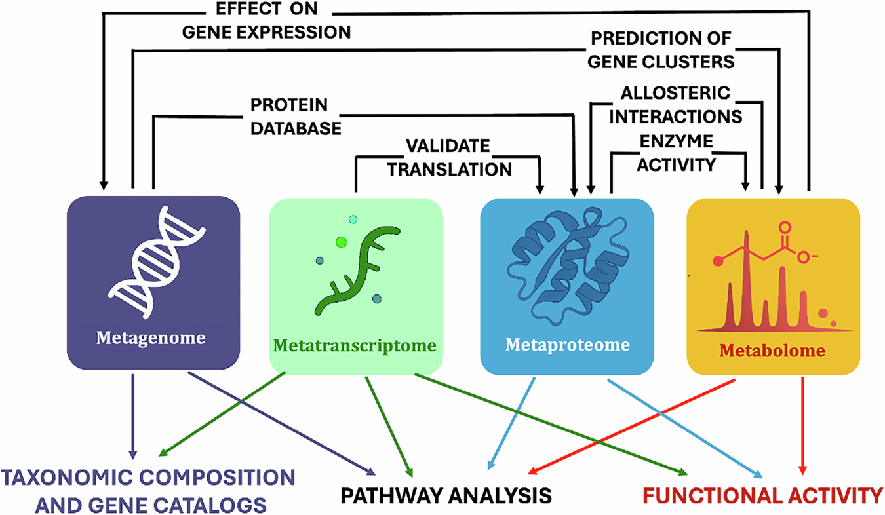
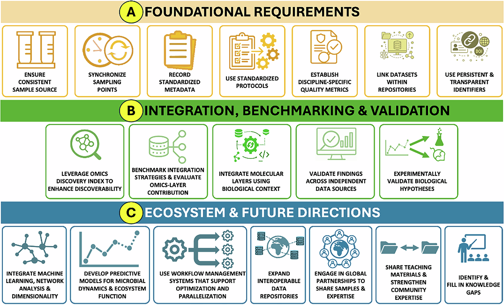

# Nature Communications：微生物组多组学别再“堆层数”——从同一样本、纵向采样到AI-ready，国际团队给出一套实操路线图

2026年9月8日，*Nature Communications* 发表了一篇Perspective：**Integrating multi-omics technologies to decipher microbiome functions**。作者来自微生物组、宏基因组、转录组、蛋白质组、代谢组、数据标准和生物信息学等多个方向，文章讨论的核心问题非常实际：

> **当一个微生物组项目同时做宏基因组、宏转录组、宏蛋白质组和代谢组时，怎样才能真正增加生物学信息，而不是只增加数据量和分析复杂度？**

这篇文章没有推出新的算法，也没有公布一个新的万人队列。它更像一份面向微生物组研究者的“项目设计与数据整合路线图”。作者把重点从“测了多少层组学”转向“增加这一层以后，结论有没有变得更可靠、更接近机制、能不能被独立验证”。

这个判断对现在的微生物组研究很重要。测序和质谱越来越成熟之后，多组学项目很容易出现一种情况：DNA、RNA、蛋白、代谢物全部做了，最后仍然是四张分别画出来的PCA、四套差异分析，再用相关性网络把它们连在一起。数据很多，真正新增的机制信息却很有限。

作者希望解决的正是这个问题。

---

## 一、先把四层组学分别在回答什么问题说清楚

微生物组多组学最常见的四层，可以用一条比较直观的逻辑理解。

| 组学层 | 最直接回答的问题 | 典型输出 |
|---|---|---|
| 宏基因组 | 谁在这里？它们理论上能做什么？ | 物种、菌株、MAG、基因、通路潜力 |
| 宏转录组 | 哪些基因正在被转录？ | RNA丰度、活跃基因、表达变化 |
| 宏蛋白质组 | 哪些蛋白真正被产生出来？ | 蛋白丰度、活跃酶、宿主与微生物蛋白 |
| 代谢组 | 最终发生了什么化学变化？ | 小分子、代谢产物、宿主—微生物化学交流 |

宏基因组给出的是**遗传潜力**。一个菌拥有某条代谢通路，并不代表它在当前环境中一定在使用这条通路。

宏转录组向前走了一步，可以告诉我们哪些基因正在转录。但RNA变化很快，而且RNA升高以后，蛋白并不会在同一时刻同步升高。

宏蛋白质组更接近实际执行功能的一层。它可以确认转录出来的基因有没有进一步形成蛋白，也可以看到宿主蛋白和微生物蛋白共同发生了什么变化。

代谢组距离最终表型更近。一个通路真正运行以后，底物、产物和中间代谢物才会发生变化。

因此四层数据关注的是同一个生物系统在不同时间尺度、不同分子层级上的状态。

*图1｜宏基因组、宏转录组、宏蛋白质组和代谢组之间的关系并非简单的单向“DNA→RNA→蛋白→代谢物”。不同层之间存在反馈、调控和时间延迟。来源：Van Den Bossche et al., Nature Communications 2026，CC BY 4.0。*

---

## 二、RNA高了，蛋白为什么可能没高？

这正是多组学最容易被误读的地方之一。

假设某个环境刺激发生后，一个代谢基因的RNA在30分钟内快速升高。对应蛋白可能几小时后才明显增加；代谢物变化还可能继续滞后。

如果研究只在一个时间点同时取样，就可能看到：

- RNA已经回落；
- 蛋白还处于高水平；
- 代谢产物刚开始积累。

这三个结果看起来“互相矛盾”，实际可能只是同一响应过程的不同阶段。

作者因此非常强调 **longitudinal、time-series、paired multi-omics**，也就是纵向、时间序列并且来自同一生物材料的多组学设计。

对于真正想解释动态机制的项目，时间点设计和样本对应关系，往往比后期再换一个更复杂的统计模型更重要。

---

## 三、同一样本，是多组学整合最基础的一步

理想设计是DNA、RNA、蛋白和代谢物尽量来源于**同一份生物样本或可追踪的同源分样**。

原因很简单。

微生物群落变化非常快。如果宏基因组来自上午的粪便、代谢组来自第二天另一份样本，即使都来自同一个人，两层数据之间也已经混入了真实的时间变化。

同样的问题会出现在环境样本中：

- 污水反应器运行状态会变化；
- 土壤水分会变化；
- 海水温度和营养盐会变化；
- 发酵体系的菌群和底物会持续变化。

作者建议尽量从共享来源样本中获得不同组学，并保持采样时间、样本量和生物量尽可能一致。

这一步看起来属于实验设计，却直接决定后续相关分析是否值得相信。

---

## 四、微生物组多组学不应该默认“四层全做”

这篇Perspective提出了一个非常值得推广的原则：

> **每增加一层组学，都应该先回答“它会给当前科学问题增加什么信息”。**

例如研究目标只是比较某种疾病中菌群组成是否变化，宏基因组可能已经足够。

如果问题进一步变成：

> 哪些微生物功能真正被激活？

这时宏转录组或宏蛋白质组开始有意义。

如果问题关注：

> 微生物产生的分子怎样影响宿主？

代谢组的重要性会明显上升。

所以多组学设计应该从**生物学问题**开始，再决定需要哪几层数据。

预算有限时，把同一批样本做好、把关键时间点做好、把表型和元数据做好，通常比在很少样本上机械增加更多组学层更有价值。

---

## 五、作者给了一个很好的工业生态案例：污水反应器

Perspective引用了一项长期污水反应器研究。

这项研究进行了约 **14个月的每周原位时间序列采样**，另外对12个离体反应器样本进行了更深入的多组学分析。

只看宏基因组，可以知道不同微生物种群的生态位和遗传潜力。

加入宏转录组、宏蛋白质组和代谢组以后，研究者进一步看到：

- 环境扰动发生后哪些基因最先响应；
- 哪些响应最终落实到蛋白层；
- 不同微生物如何通过不同功能维持系统稳定；
- 短期应激与长期功能适应怎样区分。

部分转录变化在离体扰动后 **5小时内**就能出现，而群落恢复则发生在更长的时间尺度。

这个案例很好地说明了多组学的价值：它把“群落发生了变化”继续推进到“群落怎样响应、谁在执行功能、系统为什么还能恢复”。

---

## 六、Crohn病案例：组成差不多，功能层却能把疾病位置分开

文章还讨论了一项Crohn病多组学研究。

其中一个关键发现是，单独使用宏基因组或宿主遗传数据，并不能很好地区分：

- 回肠型Crohn病；
- 结肠型Crohn病。

加入代谢组和宏蛋白质组以后，两类疾病出现更明显的分子差异。

结肠型病例表现出更多与中性粒细胞相关的蛋白信号，并与 *Bacteroides vulgatus* 等微生物特征相关；回肠型病例则出现更明显的胆汁酸变化、*Faecalibacterium prausnitzii*减少以及耐胆汁酸菌群富集。

更进一步，基于蛋白比例建立的部分标志物组合，在该研究中对疾病部位的区分能力超过了常用的粪便钙卫蛋白指标。

这里体现的是另一类多组学价值：

> **分类组成相似，并不代表功能状态相同。**

在宿主占主导、疾病信号较弱的系统中，蛋白和代谢物有时比DNA层更接近真正的疾病表型。

---

## 七、环境病毒组也是类似逻辑

作者还引用了草原土壤病毒组研究。

研究把宏基因组、宏转录组和宏蛋白质组结合起来，不仅找到了DNA和RNA病毒，还可以进一步判断：

- 哪些病毒在当前环境中真正活跃；
- 水分变化后哪些病毒响应；
- 病毒转录本是否真的形成蛋白。

对于数据库覆盖非常差的环境微生物来说，单一组学经常只能告诉我们“这里可能有一个未知序列”。

多层证据叠加以后，可以继续判断这个未知序列是否被转录、是否被翻译，从而提高功能解释的可信度。

---

## 八、多组学网络图很漂亮，但相关性特别容易产生假象

微生物组数据有一个老问题：**组成型数据（compositional data）**。

很多微生物丰度表达的是百分比或相对丰度。

假设一个群落只有A、B、C三种菌。即使B和C的绝对数量完全没变，只要A突然增加，B和C的相对比例就会下降。

于是数据中可能出现：

> A增加时，B下降。

统计上看起来像负相关，生物学上两者可能根本没有直接作用。

把这种问题继续扩展到：

- 微生物；
- RNA；
- 蛋白；
- 代谢物；

最后做成一个几千条边的相关网络，假关系可能被成倍放大。

所以作者强调，**统计整合很少能单独证明机制**。

真正强的证据仍然来自：

- 时间顺序；
- 扰动实验；
- 独立队列验证；
- 培养体系；
- 动物模型或其他体内外功能验证。

---

## 九、多组学最大的技术问题之一，是每一层“看见的范围”不同

宏基因组往往可以覆盖群落中的大量DNA。

宏蛋白质组受蛋白丰度、肽段可检测性、质谱动态范围、数据库完整度等影响，覆盖范围通常更窄。

代谢组更复杂。

没有一种单独的色谱—质谱平台可以覆盖全部代谢物。不同提取溶剂、色谱条件和离子化模式偏好的化合物类别也不同。

因此经常出现：

> DNA中有这个代谢通路，RNA中也有表达，但蛋白或代谢物层没有检测到。

这不能直接写成：

> “该通路没有产生蛋白”或“没有发生代谢”。

首先要排除对应平台的检测下限和数据库覆盖问题。

---

## 十、数据库差异本身就能制造“跨组学不一致”

宏基因组可能使用KEGG、eggNOG、GTDB或自建基因目录。

宏蛋白质组可能使用MAG预测蛋白数据库、UniProt或其他蛋白参考库。

代谢组则可能使用HMDB、MassBank、GNPS或实验室自己的标准品库。

如果不同组学依赖完全不同的ID体系，最后很容易出现：

> DNA里叫gene A，蛋白里叫protein X，代谢组里只有一个m/z feature。

三个层之间很难自动连起来。

文章因此把 **interoperability（互操作性）** 视为多组学的基础问题。

核心目标是：

> 同一生物样本、同一基因、同一蛋白和同一代谢物，可以跨平台、跨数据库、跨论文被稳定追踪。

---

## 十一、给每个样本一个稳定ID，比很多高级算法都更重要

作者推荐使用持久化样本标识符和标准化元数据体系，例如：

- BioSamples accession；
- UUID；
- MIxS：主要用于宏基因组和宏转录组元数据；
- SDRF-Proteomics：蛋白质组样本与实验设计描述；
- SMetaS：代谢组标准化元数据。

实际项目里可以把逻辑做得很简单。

例如同一份粪便样本统一使用：

`SUBJ001_T0_SAMPLE01`

然后不同组学都继承这个主ID：

`SUBJ001_T0_SAMPLE01_DNA`

`SUBJ001_T0_SAMPLE01_RNA`

`SUBJ001_T0_SAMPLE01_PROTEIN`

`SUBJ001_T0_SAMPLE01_METAB`

这样三年后重新分析时，还能明确知道哪些数据来自同一份生物材料。

---

## 十二、批次信息必须在实验开始时记录，不能等分析时再猜

文章特别强调 provenance，也就是数据处理来源和过程记录。

建议保存：

- 样本处理日期；
- 提取批次；
- 试剂批次；
- 上机顺序；
- 质谱分析block；
- 软件版本；
- 数据库版本；
- 参数；
- workflow版本。

原因很现实。

如果最后发现PCA第一主成分恰好把病例和对照分开，研究者当然会很高兴。

但如果病例全部在周一提取，对照全部在周五提取，那么这个分群就无法区分到底来自疾病还是实验批次。

多组学中这种问题更加严重，因为每一层都有自己的batch effect。

---

## 十三、作者把最佳实践分成三层

论文的第二张主图把路线图分为三个部分。

### A. 基础要求

重点是：

- 同源样本；
- 同步采样；
- 标准化元数据；
- 统一实验流程；
- QC指标；
- 数据集之间的稳定连接；
- 持久化ID。

### B. 整合、benchmark和验证

重点包括：

- 标准化报告模板；
- 参考数据集；
- 跨组学链接；
- 独立数据验证；
- 体外和体内模型；
- 明确评估增加一层组学到底带来了多少额外信息。

### C. 生态系统和未来方向

包括：

- 机器学习和预测模型；
- workflow管理；
- 公共数据库；
- 国际合作；
- 培训；
- 识别当前知识缺口。

*图2｜作者提出的多组学路线图：先把样本、元数据和QC打牢，再进行跨组学整合、benchmark和验证，最终建设可复用、可比较、AI-ready的社区基础设施。来源：Van Den Bossche et al., Nature Communications 2026，CC BY 4.0。*

---

## 十四、真正适合多数实验室的“最低要求”其实只有四条

论文没有要求每个实验室一次性做到所有理想条件。

作者把一部分建议明确为更普遍适用的最低要求。

可以概括成四件事：

**第一，问题驱动选择组学。**

每一层都要能够回答一个预先定义的问题。

**第二，样本层面能够追踪。**

不同组学必须知道是不是来自同一份或合理配对的生物材料。

**第三，元数据和QC完整。**

至少能够解释样本怎样获得、怎样处理、数据质量怎样。

**第四，分析流程可重复。**

软件版本、参数、数据库、运行环境都应该留下记录。

纵向采样、共享样本、绝对定量和多中心统一协议属于更高级的推荐实践，项目条件不足时可以分阶段实现。

这一点很重要，因为它让“最佳实践”不再只适用于大型国际联盟。

---

## 十五、现有多组学工具很多，选择时先看整合目标

Perspective列举了不少当前常用平台。

端到端或流程型平台包括：

- QIIME 2；
- bioBakery 3；
- gNOMO2；
- IMP；
- MGnify。

统计整合框架则包括：

- MOFA；
- mixOmics；
- miBiOmics；
- mmvec。

这些工具解决的问题不完全相同。

例如MOFA更接近从多个数据层中提取共同潜在因子；mixOmics提供多变量和监督学习框架；mmvec更偏向学习微生物与代谢物的共现结构。

因此分析前应该先明确：

> 我要做样本分型、寻找共同变化轴、预测表型、寻找微生物—代谢物关系，还是做机制网络？

工具选择应该跟着问题走。

---

## 十六、未来benchmark应该增加一个很关键的实验：故意删掉一层组学

这篇文章对benchmark提出了一个很实用的思路。

假设一个模型同时用了：

- metagenomics；
- metatranscriptomics；
- metaproteomics；
- metabolomics。

最终疾病预测AUC很好。

下一步应该依次删除一层：

> 去掉RNA以后，性能下降多少？

> 去掉蛋白以后呢？

> 去掉代谢物以后呢？

如果四层模型的AUC是0.90，而只用宏基因组已经有0.895，那么剩余三层的实验成本是否值得，就需要认真讨论。

如果加入代谢组后从0.70提高到0.88，并且结果能够在独立队列重复，那么这层数据显然带来了真正的增量价值。

这也是作者希望未来多组学论文回答的问题：

> **新增的组学层，究竟改变了什么结论？**

---

## 十七、benchmark还应该从“简单任务”逐步升级

作者提出的benchmark可以分层进行。

较基础的任务包括：

- 分类学预测；
- 功能组成预测；
- 通路活性预测。

更高层级则逐步进入：

- 跨组学整合；
- 扰动响应预测；
- 因果推断；
- 微生物组状态转变的时间预测。

而且不能只比较模型在同一个数据集里的交叉验证成绩。

还需要考虑：

- 独立队列；
- 不同生物样本类型；
- 不同生态系统；
- 不同实验平台；
- 体外或体内验证。

这会直接决定一个方法到底学到了可迁移的生物规律，还是只记住了某个数据集的批次特征。

---

## 十八、作者为什么一直强调“phenotype”？

微生物组研究很容易沉浸在内部数据关系中。

例如发现：

> 某个菌和某个代谢物高度相关。

如果这个变化和患者症状、肺功能、血糖、药物响应、污水处理效率或土壤碳循环完全没有联系，它的生物意义仍然有限。

文章把宿主或环境**表型**视为系统层面的锚点。

临床项目中的表型可以是：

- 疾病状态；
- 生理指标；
- 治疗反应；
- 生存结局。

环境项目可以是：

- 反应器性能；
- 温室气体排放；
- 营养循环速率；
- 生态系统稳定性。

这样多组学就形成：

**微生物组成 → 分子活动 → 功能结果 → 系统表型**

的可检验链条。

---

## 十九、AI想在微生物组领域做到“AlphaFold级”突破，前提是先把数据整理好

论文摘要里用了一个很大胆的愿景：

> 微生物组领域未来可能出现类似AlphaFold级别的AI进展。

这里更应该关注作者给出的前提条件。

AI模型需要的数据必须：

- FAIR；
- 样本可追踪；
- 元数据完整；
- 不同组学能够正确配对；
- benchmark任务清晰；
- 训练集具有代表性；
- 有真实表型或实验ground truth。

否则模型可能非常擅长预测：

> 哪个实验室做的样本。

却未必真正学到：

> 微生物组为什么产生某个表型。

---

## 二十、以后使用AI分析多组学，还要把“模型版本”也写进Methods

这篇文章提出了一个很容易被忽视的新问题。

传统生信Methods会记录：

- 软件名称；
- 软件版本；
- 参数；
- 数据库版本。

如果使用在线AI系统，还应该额外记录：

- 模型版本；
- prompt；
- 参数设置；
- 调用日期；
- 关键输出；
- 必要时保存模型或API版本信息。

因为云端AI模型会持续更新。

同一个prompt半年以后再运行，结果可能已经不同。

从可重复性角度看，“用了ChatGPT/某大模型”这种写法的信息量，和“使用某软件”却不写版本差不多。

---

## 二十一、作者希望建立怎样的公共基础设施？

文章列出了多个已经存在的社区资源和合作方向。

例如：

- CAMI：宏基因组分析benchmark；
- Genomic Standards Consortium：基因组数据标准；
- Human Microbiome Project / iHMP：人类微生物组及纵向多组学；
- Earth Microbiome Project：跨生态系统标准化微生物调查；
- STORMS、STREAMS：微生物组研究报告规范；
- Metaproteomics Initiative；
- CAMPI-Multi-omics；
- INFOGUT等标准化项目。

作者希望下一步把这些相对分散的体系进一步连接起来，形成真正跨DNA、RNA、蛋白和代谢物的benchmark数据集。

理想情况下，同一套reference sample可以分发给不同实验室。

这样才能知道：

> 同一个样本换一个实验室、一个平台、一个流程以后，结果会差多少？

只有先量化技术误差，才知道后面的生物差异是否可信。

---

## 二十二、一个普通微生物组多组学项目，可以怎样设计？

如果把整篇Perspective压缩成一个比较现实的项目流程，可以这样执行。

### 第一步：先写科学问题

例如：

> 某种饮食干预是否通过改变微生物代谢影响血糖？

### 第二步：根据问题选组学

宏基因组用于菌和功能潜力。

宏转录组用于确定干预后哪些基因快速响应。

代谢组用于寻找真正改变的微生物或宿主代谢物。

如果蛋白层并不是关键问题，预算不足时不一定必须加入。

### 第三步：把时间点设计在分析之前

至少考虑：

- baseline；
- 早期响应；
- 稳定响应；
- 必要时恢复期。

### 第四步：同一份材料分层测量

每个样本必须有稳定主ID，并明确每一层对应关系。

### 第五步：先做各层QC，再谈整合

不能因为最终目标叫multi-omics，就跳过每一层自己的质量控制。

### 第六步：建立单组学baseline

先问：

> 只用宏基因组能解释多少？

然后再测量RNA、蛋白和代谢物带来的新增信息。

### 第七步：跨层连接

优先使用具有明确生物意义的连接：

**MAG → gene → transcript → protein → reaction → metabolite。**

相关性网络可以作为探索工具，后面仍需结合时间、通路和实验验证。

### 第八步：独立验证

至少选择一部分最重要的机制假设，在：

- 独立人群；
- 新批次样本；
- 培养体系；
- 动物模型；

中进一步确认。

---

## 二十三、对生信人员来说，未来真正难的是“数据工程”

过去很多生信项目最大的工作量是：

> 跑软件。

多组学项目越来越像大型数据工程。

需要同时管理：

- 样本ID；
- 不同组学文件；
- 特征ID；
- 数据库映射；
- 软件版本；
- batch；
- phenotype；
- missing value；
- 数据更新版本。

如果这些基础结构一开始没有设计好，后面无论使用MOFA、mixOmics还是深度学习，都会非常痛苦。

因此一个成熟的多组学项目，往往应该在采样前就让：

**实验人员 + 临床/生态人员 + 生信人员 + 统计人员**

一起讨论数据结构。

---

## 二十四、这篇Perspective最值得带回项目里的判断标准

以后看到一个多组学项目，可以连续问几个问题：

> 每一层组学为什么要测？

> 不测这一层，主要结论会不会改变？

> 四层数据是否来自真正可对应的样本？

> 时间点是否能够解释RNA、蛋白和代谢物之间的滞后？

> 数据库和ID能不能跨层连接？

> 相关性有没有受到组成型数据和batch影响？

> 是否存在独立验证或扰动实验？

> 最终有没有连接到真正的宿主或环境表型？

如果这些问题都回答得比较清楚，多组学才开始具有真正的解释力。

---

# 结语：微生物组研究的瓶颈正在从“测不到”转向“解释不统一”

过去十多年，微生物组技术解决了大量数据生成问题。

宏基因组告诉我们群落里有什么。

宏转录组告诉我们哪些基因正在响应。

宏蛋白质组告诉我们哪些功能真正进入执行层。

代谢组则把这些变化继续连接到具体化学产物和宿主—微生物交流。

现在更困难的问题，是怎样把这些层真正连成一个可重复、可验证的生物学解释。

这篇 *Nature Communications* Perspective给出的方向很明确：

**问题驱动选择组学**

→ **同源样本和时间同步**

→ **标准化元数据与QC**

→ **统一ID和跨层映射**

→ **可重复workflow**

→ **单组学baseline与增量价值评估**

→ **独立验证和实验验证**

→ **建立开放benchmark和AI-ready数据资源。**

未来一个高质量微生物组多组学项目的竞争力，很可能不再来自“我们做了四组学”。

真正有说服力的表达会变成：

> **增加这一层测量以后，我们发现了单组学看不到的功能关系；这个关系能够跨数据集重复，并且最终得到实验或表型层面的支持。**

当这种标准成为常态，多组学才会从数据叠加走向真正的机制整合。

---

## 论文信息

Van Den Bossche T, Lazau EA, Aho VTE, et al. **Integrating multi-omics technologies to decipher microbiome functions.** *Nature Communications* 17, 9600 (2026).

DOI: https://doi.org/10.1038/s41467-026-77539-4

Published: 8 September 2026.

文章为 **CC BY 4.0 Open Access**。本文保留的论文主图依据该许可使用；如具体第三方材料另有credit line，则以原论文标注为准。
