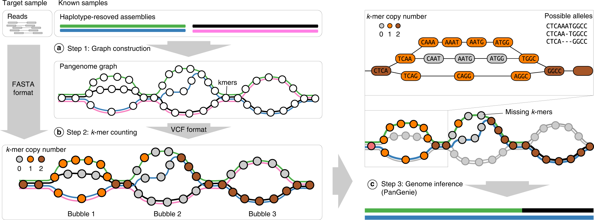
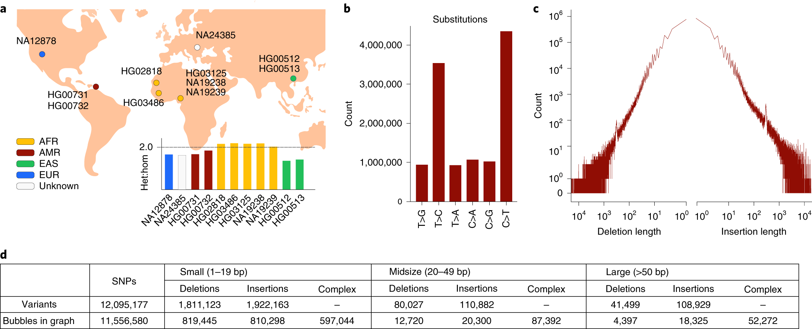
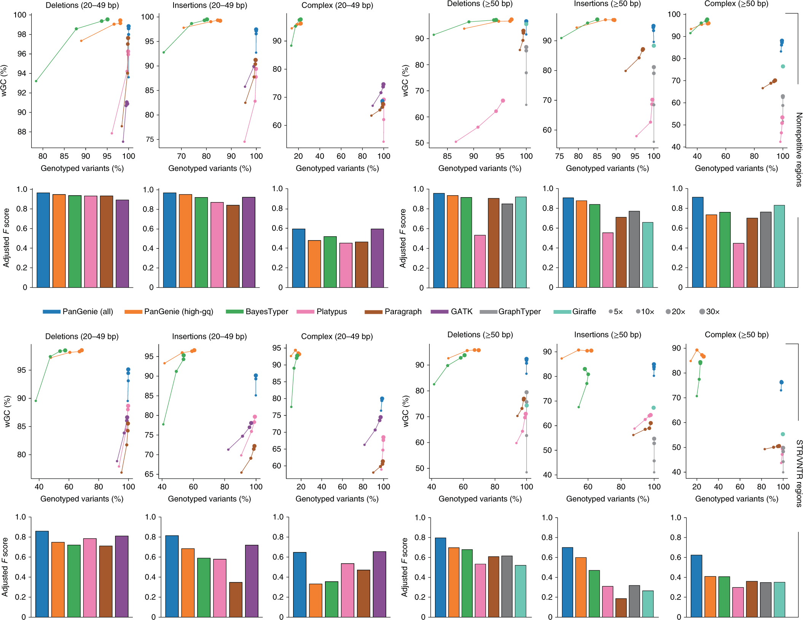
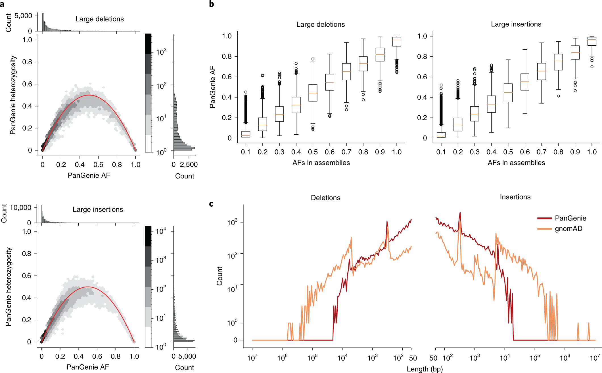
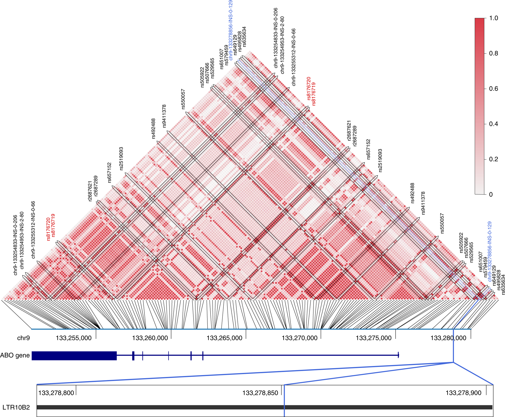

# Nature Genetics：11个人的高质量组装，给300份短读长补上结构变异——PanGenie无需比对，30×测序速度快4倍以上

人类基因组分析长期有一个很现实的矛盾。

长读长测序能够看清大型插入、缺失、串联重复和复杂结构变异，但如果研究对象从几十个人扩大到几万、几十万人，成本仍然很高。短读长便宜、成熟、适合大队列，却最容易在重复区域和结构变异附近“看不清”。

2022年，Jana Ebler、Peter Ebert、Tobias Marschall等人在 *Nature Genetics* 发表 PanGenie，提出了一条很有代表性的泛基因组路线：先用少量高质量、单倍型分辨的完整基因组建立参考面板，再利用普通短读长去判断新样本携带哪些已知变异。

论文使用11个互不相关个体的高质量单倍型组装构建泛基因组参考，随后用Illumina短读长测试SNP、小indel和结构变异。30×覆盖度下，PanGenie比传统基于read mapping的方法快4倍以上；优势最大的部分恰好是短读长最难处理的重复区域和大型插入、缺失。作者进一步把方法应用到100个1000 Genomes三人家系、共300个样本，并找到大量传统短读长SV数据库没有收录的常见结构变异。

这篇论文的价值可以浓缩成一句话：

> **少量高质量长读长组装负责建立“地图”，大量便宜短读长负责在地图上快速定位。**

它也是今天人类泛基因组为什么能够真正进入群体遗传学的重要技术路线之一。

---

## 一、传统短读长基因分型为什么会有“参考偏倚”？

经典流程通常是：

**short reads → 比对到GRCh38 → 找变异 → 判断0/0、0/1或1/1。**

问题在于GRCh38本质上是一条线性参考序列。

如果一个人的基因组中存在参考序列没有的大片段插入，reads很难找到理想落点；如果变异位于串联重复、节段重复或其他高度相似区域，同一条短read又可能对应多个位置。

因此，最容易丢失的信息往往包括：

- 大型插入；
- 重复区域中的缺失；
- VNTR和STR；
- 多等位复杂区域；
- 某些HLA区域变异。

这不是短读长测序本身完全没有信息，而是单一线性参考很难把这些信息组织起来。

PanGenie的思路，是先把多个人的完整单倍型放到同一套泛基因组框架中，让一个位置可以同时存在多条真实人类单倍型路径。

---

## 二、PanGenie并不先把reads比对到参考基因组

PanGenie名字来自 **Pangenome-based Genome Inference**。

整个方法可以理解成三步。

第一步，用已经完成高质量组装的个体建立泛基因组图。一个变异位置可以想象成图上的一个“岔路口”：参考等位基因走一条路，插入、缺失或其他等位基因走另一条路；每个已知单倍型则是一条穿过整张图的连续路径。

第二步，把目标样本的短读长拆成31 bp的小片段，也就是31-mer，然后统计每种31-mer在reads里出现多少次。

第三步，把“这个位置看到了哪些31-mer”和“已知人群中哪些变异经常连在同一条单倍型上”一起考虑，推断新样本最可能携带哪两条局部单倍型。

*图1｜PanGenie整体流程：高质量单倍型组装建立泛基因组图；目标样本只需要普通短读长；模型把k-mer计数和已知单倍型路径结合起来，推断新样本基因型。来源：Ebler et al., Nature Genetics 2022，CC BY 4.0。*

这里最关键的地方，是PanGenie没有只靠某一个变异位点附近的reads。

如果一个重复区域几乎没有唯一k-mer，单看这个位置可能无法判断基因型。但如果它旁边几个位置能够确定某条已知单倍型，而这些变异在参考面板里长期一起出现，模型仍然可以借助邻近连锁信息完成推断。

---

## 三、隐藏马尔可夫模型在这里做什么？

论文使用HMM，也就是隐藏马尔可夫模型。

不用记公式，可以把它理解成：

> 新个体的两条染色体，在局部区域很可能像参考面板中的某两条单倍型；沿着染色体往前走，偶尔会因为历史重组切换到另一条单倍型。

模型一边看短读长31-mer支持哪种序列，一边利用相邻位置之间的连锁关系，寻找整段基因组最合理的单倍型组合。

这正是PanGenie与普通k-mer genotyper之间的重要差别。

普通k-mer方法在重复区域常常遇到“没有唯一k-mer就无法判断”的问题。PanGenie增加了长距离单倍型信息，所以即使局部信号弱，也可能利用周围信息恢复基因型。

---

## 四、建立参考泛基因组：14个人中使用11个互不相关个体

作者收集了14个具有PacBio HiFi数据的个体，其中包括三个父母—子女三人家系，分别来自Yoruba、Puerto Rican和Southern Han Chinese人群，另外还包括NA12878、HG02818、HG03125、NA24385和HG03486等常用参考样本。

三个孩子主要用于质量控制，最终构建变异集合和泛基因组图时使用 **11个互不相关个体**，也就是22条单倍型。

这些高质量组装被用来发现从SNP、小indel到≥50 bp结构变异的多种变异，然后把重叠变异整理成泛基因组图中的“bubble”。

*图2｜11个个体的单倍型组装产生从SNP、小indel到大型结构变异的多层次变异集合，并被组织成泛基因组图中的双等位或复杂bubble。来源：原论文，CC BY 4.0。*

这个设计也说明了PanGenie的一个前提：

> **高质量参考面板必须先存在。**

它不是让普通30×短读长凭空发现所有未知结构变异，而是把参考面板里已经观察到的变异，高效地扩展到更多样本。

---

## 五、作者用“留一法”测试：把一个人完全从参考面板里拿掉

为了模拟真实应用，作者做了两轮leave-one-out实验。

例如测试NA12878时，先把NA12878的高质量组装从泛基因组参考中移除，只用其他人的变异建立面板；然后只给PanGenie看NA12878的Illumina短读长，让软件重新判断它的基因型。

最后再用NA12878自己的高质量组装作为truth set进行比较。

同样的实验还在NA24385上重复了一次。

测序深度覆盖：

- 5×；
- 10×；
- 20×；
- 30×。

比较的软件包括PanGenie、BayesTyper、Paragraph、Platypus、GATK、GraphTyper和Giraffe，既有k-mer方法，也有线性参考或图参考的read-mapping方法。

这比“拿训练面板里的样本重新测试”严格得多，因为目标个体的真实单倍型没有被直接放在参考面板中。

---

## 六、真正拉开差距的是重复区域里的大型结构变异

SNP通常是相对容易的任务。

PanGenie最明显的优势出现在短读长传统上最难处理的地方：STR/VNTR等重复区域，以及20 bp以上特别是≥50 bp的插入和缺失。

在30×覆盖度、重复区域的大型SV中，PanGenie不做严格质量过滤时的加权基因型一致率大约达到：

| 变异类型 | PanGenie | 最好的mapping方法 |
|---|---:|---:|
| 大型插入 | **85%** | 64% |
| 大型缺失 | **92%** | 79% |
| 复杂多等位区域 | **76%** | 51% |

大型插入的F score约为 **0.70**，其他比较方法都低于0.50。

*图3｜NA12878留一法benchmark。上半部分为非重复区，下半部分为STR/VNTR区域；比较5×到30×覆盖度以及30×下的F score。PanGenie的优势在大型插入、缺失和复杂重复区域最明显。来源：原论文，CC BY 4.0。*

这说明泛基因组的价值并不只是“把更多序列放进参考”。

真正有用的是：

> **这些序列还保留了它们在真实染色体上如何组合成单倍型的信息。**

---

## 七、小indel同样受益，尤其是在STR/VNTR里

在重复区域的小插入和小缺失中，PanGenie在30×下的加权基因型一致率分别达到：

- 插入：**90.4%**；
- 缺失：**92.8%**。

同一场景下表现最好的传统mapping工具GATK约为：

- 插入：83.0%；
- 缺失：86.9%。

如果只保留高质量基因型，PanGenie和BayesTyper都能把一致率推到非常高，但代价是丢掉一部分无法可靠分型的位点。

因此评价genotyper时不能只看accuracy，还必须同时看：

> **它到底给多少变异成功出了结果。**

一个工具只给最容易的20%位点分型，即使准确率99%，对群体遗传学也未必最有用。

---

## 八、HLA区域是一个很好的压力测试

HLA区域高度多态、重复复杂，是短读长分析最难的区域之一。

作者在HG00731、NA12878和NA24385上专门做了HLA留一验证。

不同基因差别很大。

例如HLA-C、HLA-DPA1、HLA-DPB1和HLA-DRA在较简单的双等位区域中平均一致率达到 **98%–100%**；复杂区域中多个HLA基因也达到 **93%–100%**。

但HLA-DRB1和C4明显困难，在双等位区域平均只有约58%和79%。

这说明PanGenie可以显著改善复杂区域，但并没有“解决所有复杂基因组区域”。

HLA、C4和高度重复拷贝数区域仍然需要非常谨慎。

---

## 九、速度：30×下比mapping流程快4倍以上

PanGenie绕开了全基因组read alignment。

在论文的30×短读长测试中，它比传统mapping-based流程 **快4倍以上**。

大队列实验中，PanGenie平均每个样本大约需要 **30个单核CPU小时**。

这里的“30个单核CPU小时”不等于必须真的等30小时。实际集群中可以对不同样本并行运行。

真正重要的是，样本量从几百扩大到几万时，省掉大规模BAM生成、排序和比对，会明显降低计算和存储压力。

不过这篇论文发表于2022年，所以具体运行时间更适合当作方法学基线，而不是2026年服务器上的固定性能数字。现在的软件版本、CPU、压缩格式和泛基因组规模都已经发生变化。

---

## 十、作者随后真的拿300个人做了一次群体分型

作者从1000 Genomes中随机选择 **100个三人家系，共300人**。

五个超级人群各选择20个trio：

- AFR；
- AMR；
- EAS；
- EUR；
- SAS。

泛基因组参考仍然只有前面的11个assembly样本。

作者利用100个家系的孟德尔遗传一致性，再结合PanGenie自己的genotype quality和参考样本自检结果，给每个结构变异建立可靠性评分，并形成严格版和宽松版两个高质量集合。

宽松集合最终保留了参考面板中约：

- **78%的插入SV**；
- **83%的缺失SV**。

然后用其中200个互不相关个体做群体统计。

---

## 十一、119,126个可可靠分型的SV，群体频率看起来很合理

宽松集合中包括：

- **84,836个≥50 bp插入**；
- **34,290个≥50 bp缺失**。

合计：

> **119,126个结构变异等位基因。**

作者没有只依赖软件内部quality score，而是用两个独立现象检查结果。

第一，基因型得到的等位基因频率和杂合度整体接近Hardy–Weinberg平衡。重复区域中90.7%的SV、非重复区域中90.9%的SV没有显著偏离HWE。

第二，200个短读长样本估计的等位基因频率，与11个高质量assembly样本中的粗略频率高度一致。

*图4｜PanGenie用于100个1000 Genomes三人家系。图中检查119,126个大型插入/缺失的群体频率、杂合度，以及与11个assembly参考样本频率的一致性，并与gnomAD SV比较。来源：原论文，CC BY 4.0。*

---

## 十二、最令人意外的一点：71%的SV当时不在gnomAD里

作者把119,126个可分型SV与当时基于14,891个基因组构建的gnomAD-SV比较。

只有：

> **34,468个**

能够匹配。

另外：

> **84,658个，也就是71%**

没有出现在gnomAD中。

而这84,658个变异中：

- 约80%位于STR/VNTR区域；
- **43%在人群中的等位基因频率≥5%**。

后面这个数字尤其重要。

它意味着这些并不全是“只在一个人身上偶然出现的超稀有SV”。相当一部分其实是常见人群变异，只是传统短读长SV发现流程很难稳定看到。

这正是泛基因组对GWAS最直接的价值之一：

> 过去有些区域看起来只有附近SNP和疾病相关，真正影响功能的变异可能是没有进入常规分型面板的结构变异。

---

## 十三、250个医学相关SV里，PanGenie参考集合覆盖209个

作者还拿GIAB整理的250个医学相关结构变异进行检查。

其中：

- 209个存在于他们的assembly变异集合；
- 174个进入PanGenie宽松高质量集合；
- 119个进入最严格集合。

这并不能说明PanGenie可以替代临床级结构变异检测。

但它说明，如果医学相关SV已经由高质量泛基因组发现并加入参考面板，普通短读长有机会在大规模队列里重新获得这些位点的基因型。

对于回顾性队列尤其重要：很多大型生物样本库已经积累了海量短读长数据，不可能全部重新做长读长测序。

---

## 十四、作者进一步问：过去GWAS里的SNP，会不会只是替真正的SV“站岗”？

GWAS经常得到一个显著SNP。

但显著SNP不一定就是因果变异。它可能只是和真正功能变异处在同一个单倍型块中。

作者从NHGRI-EBI GWAS Catalog挑出 **3,404个反复出现的疾病/性状相关SNP**，检查它们附近1 Mb范围内有没有与之高度连锁的结构变异。

结果：

> **147个GWAS SNP附近存在r²≥0.8的SV。**

这为“结构变异可能是部分GWAS信号真正功能来源”提供了候选列表。

---

## 十五、ABO附近一个129 bp插入，和6个LDL相关GWAS SNP高度连锁

最典型的例子位于9号染色体ABO附近。

作者发现一个：

> **129 bp插入**

与6个过去和LDL胆固醇水平相关的GWAS SNP处于高度连锁状态。

这个插入位于LTR10B2内源性逆转录病毒相关的长串联重复区域，本质上是一个43 bp序列的重复扩增：参考基因组中只有1份，而插入等位基因中增加3份，最终达到4份。

重要的是，这个区域本身非常重复，恰好属于普通短读长最不容易直接发现和分型的类型。

*图5｜LD分析。在ABO附近发现129 bp重复扩增，与6个LDL胆固醇相关GWAS SNP高度连锁。图中红色标记为ABO血型相关位点。来源：原论文，CC BY 4.0。*

这里仍然不能直接说：

> “这个129 bp插入就是导致LDL变化的因果突变。”

论文做的是连锁分析，结果提供了值得后续功能验证的SV候选。

---

## 十六、另一个322 bp插入落在CCDC91内含子

作者还发现一个位于12号染色体CCDC91基因内含子的：

> **322 bp插入。**

它靠近ENCODE标记的调控元件，并与两个和体脂相关的GWAS变异处于LD，其中一个SNP还与该区域大量变异呈完全连锁。

这再次说明：

SNP-GWAS信号附近可能隐藏着过去没有被常规短读长caller纳入分析的插入或重复变异。

泛基因组不会自动告诉我们哪个变异具有因果作用，但它能把过去“看不见”的候选重新放回统计分析。

---

## 十七、PanGenie特别适合解决什么问题？

如果手里已经有：

1. 一套高质量、单倍型分辨的泛基因组参考；
2. 大量Illumina全基因组短读长样本；
3. 希望同时分析SNP、indel和SV；
4. 特别关心重复区域、大型插入和缺失；

PanGenie是很自然的工具选择。

它特别适合：

- 大型人群队列重新做SV genotyping；
- 给历史短读长数据补上泛基因组中的已知SV；
- 在GWAS中加入结构变异；
- 在不同人群中估计已知SV的频率；
- 检查疾病SNP附近是否存在高LD结构变异。

---

## 十八、它不适合被理解成“短读长万能SV发现器”

这是使用PanGenie时最重要的边界。

PanGenie主要回答：

> **参考泛基因组中已经存在的这个变异，新样本有没有？**

如果某个新样本携带一个参考面板从未见过的私人插入，PanGenie没有相应图路径，就无法直接正确分型。

作者在Discussion中也明确把“发现面板之外的新变异”列为未来方向，例如可以分析那些无法被现有泛基因组解释的k-mer，再用于rare variant discovery。

所以完整工作流更像：

**高质量长读长样本发现变异**

→ **构建并更新泛基因组参考**

→ **PanGenie把已知变异扩展到大规模短读长队列**

→ **统计关联和功能验证**。

---

## 十九、参考面板越大，并不意味着计算可以无限扩展

PanGenie的HMM需要在每个位置考虑可能的单倍型组合。

因此运行时间会随着参考单倍型数量增加。

论文当时只有22条参考单倍型，作者已经明确指出，如果把面板扩大很多，需要进一步压缩搜索空间、分阶段处理或采用类似统计定相软件的剪枝策略。

对于多倍体，组合数量会进一步膨胀，所以原始实现也不适合直接照搬到复杂多倍体基因组。

这一点对植物研究尤其重要。

PanGenie的方法思想可以迁移到植物，但人类二倍体上的原始benchmark不能直接等同于小麦、马铃薯等多倍体中的实际性能。

---

## 二十、2022年的PanGenie现在应该怎么看？

这篇论文发表时，人类泛基因组还处在“几十个高质量assembly正在改变参考基因组”的早期阶段。

几年后，人类泛基因组参考已经扩大，PanGenie本身也持续更新。当前官方文档仍把它定义为：利用已知完整单倍型和short-read k-mer计数，对泛基因组图中的SNP、indel和SV进行全基因组分型。

因此，这篇2022论文更适合用来理解PanGenie的核心设计，而不是把当年的软件版本和速度排名当成今天永久固定的benchmark。

实际项目应重新检查：

- 当前PanGenie版本；
- 当前人类泛基因组面板；
- 自己数据的人群构成；
- 需要研究的SV类别；
- 目标样本测序深度；
- 最新同类graph genotyper的表现。

但它建立的基本思想至今仍然重要：

> **长读长不必给每个人都测。可以先让少量高质量组装提供结构和单倍型知识，再让大规模短读长利用这些知识。**

---

## 二十一、对做GWAS的人，真正需要改变的是输入变异集合

传统GWAS常常从几百万SNP开始。

如果泛基因组参考中已经存在可靠的：

- 50 bp以上插入；
- 串联重复扩增；
- 中小型缺失；
- 复杂多等位变异；

那么这些变异也应该有机会进入association matrix。

PanGenie这篇论文最有启发性的结果之一，就是 **71%的可可靠分型SV没有出现在当时的gnomAD-SV中，其中43%还是AF≥5%的常见变异**。

这说明历史上“没进GWAS”的一些结构变异，并不一定因为它们太稀有，而可能只是因为技术流程没有稳定测到它们。

泛基因组时代的GWAS因此会逐渐从：

> SNP association

扩展到：

> **SNP + indel + SV + tandem repeat + complex allele。**

---

# 结语：泛基因组真正改变的，是让“少数人的完整基因组”可以服务“多数人的便宜测序”

PanGenie没有试图让短读长变成长读长。

它采取的是另一条路线：

先从高质量单倍型组装里学习真实的人类变异和连锁结构，再利用短读长提供的31-mer计数，判断一个新个体最可能沿着哪些已知单倍型路径前进。

在论文的留一验证中，这套方法对SNP和小indel保持良好表现，同时在重复区域的大型结构变异上明显优于传统mapping流程。30×覆盖度下，大型插入、缺失和复杂区域的加权基因型一致率分别达到约85%、92%和76%，而最好的mapping方法约为64%、79%和51%。

随后作者把22条参考单倍型用于300个1000 Genomes样本，在宽松高质量集合中得到119,126个可分型的大型插入和缺失。和当时gnomAD-SV比较，其中71%没有被收录，而且相当一部分是常见变异。

最后，3,404个反复出现的GWAS SNP中有147个附近存在高度连锁的结构变异；ABO附近129 bp重复扩增就是一个典型例子。

这篇论文把泛基因组的实际价值展示得很清楚。

泛基因组的目标不只是做一张更复杂、更漂亮的参考图。

真正重要的是：

> **把过去只有长读长和高质量组装才能看到的结构信息，重新带回到成千上万甚至数十万份已经存在的短读长队列中。**

当这个环节成熟以后，过去建立在SNP上的人群遗传学和GWAS，就有机会系统地把结构变异重新纳入研究视野。

---

## 论文信息

Ebler J, Ebert P, Clarke WE, et al. **Pangenome-based genome inference allows efficient and accurate genotyping across a wide spectrum of variant classes.** *Nature Genetics* 54, 518–525 (2022). DOI: 10.1038/s41588-022-01043-w.

论文为 **CC BY 4.0 Open Access**。主文图片在无单独第三方credit line排除的情况下包含于该许可；转载或改编时应保留作者、论文来源、许可证并说明是否修改。
